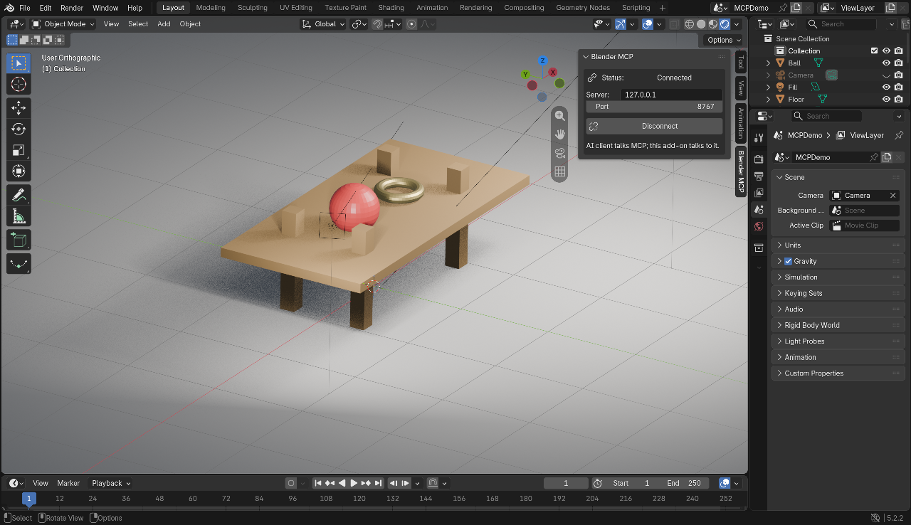

# Blender MCP Server

**Blender MCP Server** lets AI clients control a running Blender through the
[Model Context Protocol](https://modelcontextprotocol.io). Point Claude, Cursor,
OpenCode or any other MCP client at it, and the model can inspect the scene,
create and edit objects, run renders, and execute Blender Python.

Everything runs locally. There is no cloud component, no account, no database.

```text
User
 │
 ▼
AI client  ── "make me a table"
 │
 │ MCP (stdio)
 ▼
┌────────────────────────────┐
│  Blender MCP Server        │
│                            │
│  Tools      blender.*      │
│  Resources  blender://     │
│  Validation AST policy     │
└─────────────┬──────────────┘
              │ WebSocket (JSON)
              ▼
┌────────────────────────────┐
│  Blender add-on            │
│                            │
│  main-thread dispatch      │
│  bpy / bmesh / operators   │
└─────────────┬──────────────┘
              ▼
           Blender
```

The two processes are separate on purpose. The MCP server **never** imports
`bpy`; the add-on **never** imports the MCP SDK. They meet at one JSON protocol
over a WebSocket, which is what makes each half testable on its own and what
will let the transport change later without touching either side.

---

## Table of contents

- [Requirements](#requirements)
- [Installation](#installation)
- [Installing the Blender add-on](#installing-the-blender-add-on)
- [Running the server](#running-the-server)
- [Connecting an AI client](#connecting-an-ai-client)
- [First test](#first-test)
- [Testing it](#testing-it)
- [MCP tools](#mcp-tools)
- [MCP resources](#mcp-resources)
- [Example AI workflows](#example-ai-workflows)
- [Units and conventions](#units-and-conventions)
- [Error handling](#error-handling)
- [The bridge protocol](#the-bridge-protocol)
- [Security: `blender.execute_python`](#security-blenderexecute_python)
- [Transactions and undo](#transactions-and-undo)
- [Configuration](#configuration)
- [Project layout](#project-layout)
- [Development](#development)
- [Roadmap](#roadmap)
- [License](#license)

---

## Requirements

| | |
|---|---|
| Python | 3.11 or newer |
| Blender | 3.6 or newer (4.x recommended) |
| MCP SDK | `mcp` 2.x — the current major version |
| Blender add-on dependencies | none (standard library only) |

The add-on deliberately has **no** pip dependencies. Blender's bundled Python
ships neither `websockets` nor `pydantic`, so `addon/blender_mcp/websocket.py` is
a small RFC 6455 client built on `socket`, and `protocol.py` is a plain-dict
mirror of the server's models. Nothing needs installing into Blender itself.

## Installation

```bash
git clone https://github.com/your-org/blender-mcp.git
cd blender-mcp

python3 -m venv .venv
source .venv/bin/activate          # Windows: .venv\Scripts\activate

pip install -e .
```

Optionally copy the example environment file and edit it:

```bash
cp .env.example .env
```

You can also install with the dev extras, which bring in pytest and the linters:

```bash
pip install -e ".[dev]"
```

Check that the server starts:

```bash
python -m server.main
```

It will print a startup line to stderr and then sit waiting on stdio, which is
normal: with no AI client attached, silence is the correct behaviour. Watch the
logs from another terminal while you start Blender.

## Installing the Blender add-on

1. Zip the add-on package **including the top-level folder**:

   ```bash
   cd addon
   zip -r blender_mcp.zip blender_mcp -x '*.pyc' '*__pycache__*'
   ```

   The archive must contain `blender_mcp/__init__.py` at its root.

2. In Blender: **Edit → Preferences → Add-ons → Install…** (or *Install from
   Disk* in 4.2+) and select `blender_mcp.zip`.

3. Enable the **Development: Blender MCP** check box.

4. Open the 3D Viewport, press <kbd>N</kbd>, and switch to the **Blender MCP**
   tab:

   ```text
   ┌──────────────────────────┐
   │ Blender MCP              │
   │                          │
   │ Status: Connected        │
   │ Server: 127.0.0.1:8765   │
   │                          │
   │ Host: [127.0.0.1      ]  │
   │ Port: [8765            ]  │
   │                          │
   │ [      Connect      ]    │
   └──────────────────────────┘
   ```

5. Press **Connect**. The status turns green once the add-on has reached the
   MCP server; it retries automatically with a backoff if the server is not up
   yet, so you can start Blender first and the server second.

Blender must be the one holding the connection: the MCP server only ever dials
nothing, it listens.

## Running the server

The server speaks **stdio**, which is what MCP clients spawn:

```bash
python -m server.main
```

or, equivalently, through the installed console script:

```bash
blender-mcp-server
```

It opens two things at once:

* the MCP stdio channel to the AI client, and
* a WebSocket listener on `BLENDER_HOST:BLENDER_PORT` (default
  `127.0.0.1:8765`) for the add-on.

Both start and stop with the process, and **all logs go to stderr** — stdout
belongs to the protocol.

For debugging you can also serve MCP over HTTP instead:

```bash
MCP_TRANSPORT=streamable-http MCP_PORT=8000 python -m server.main
```

### Checking the bridge without an AI client

Two scripts speak the bridge protocol directly:

```bash
python examples/create_cube.py     # one cube, one round trip
python examples/create_scene.py    # a table, several requests, in a transaction
```

They are clients of the bridge, not of Blender, so they run anywhere Python 3.11
is available. See [Testing it](#testing-it) for more ways to check a change.

## Connecting an AI client

Add the server to your client's MCP configuration. The command is the
interpreter from your virtual environment, so the client can find the
dependencies.

**Claude Desktop** — `claude_desktop_config.json`
(`~/Library/Application Support/Claude/` on macOS,
`%APPDATA%\Claude\` on Windows):

```json
{
  "mcpServers": {
    "blender": {
      "command": "/absolute/path/to/blender-mcp/.venv/bin/python",
      "args": ["-m", "server.main"],
      "env": {
        "BLENDER_HOST": "127.0.0.1",
        "BLENDER_PORT": "8765",
        "ALLOW_PYTHON_EXECUTION": "true"
      }
    }
  }
}
```

**Cursor** — `.cursor/mcp.json` in your project, or the global
`~/.cursor/mcp.json`:

```json
{
  "mcpServers": {
    "blender": {
      "command": "/absolute/path/to/blender-mcp/.venv/bin/python",
      "args": ["-m", "server.main"],
      "env": {
        "ALLOW_PYTHON_EXECUTION": "true"
      }
    }
  }
}
```

**OpenCode** — `opencode.json`:

```json
{
  "$schema": "https://opencode.ai/config.json",
  "mcp": {
    "blender": {
      "type": "local",
      "command": ["/absolute/path/to/blender-mcp/.venv/bin/python", "-m", "server.main"],
      "enabled": true,
      "environment": {
        "ALLOW_PYTHON_EXECUTION": "true"
      }
    }
  }
}
```

Restart the client after editing. If a tool call fails with `NOT_CONNECTED`,
the bridge is up but the add-on is not connected — check the Blender panel.

> `.env` is read relative to the **server process's working directory**, and an
> MCP client chooses that for you. For a setup you can rely on, pass the
> settings in the `env` block of the client's MCP configuration, as above.

## First test

Say to your AI client:

> Create a red cube at the origin.

A good model does this in two calls:

```text
blender.create_object  {"type": "cube", "name": "RedCube", "location": [0, 0, 0]}
```

```text
blender.execute_python
import bpy

cube = bpy.data.objects["RedCube"]
material = bpy.data.materials.new("Red")
material.use_nodes = True
material.node_tree.nodes["Principled BSDF"].inputs["Base Color"].default_value = (0.8, 0.05, 0.05, 1.0)
material.diffuse_color = (0.8, 0.05, 0.05, 1.0)   # so the solid viewport matches
cube.data.materials.append(material)

result = {"object": cube.name, "material": material.name}
```

> Setting only `material.diffuse_color` is the classic mistake: it colours the
> solid viewport but leaves the Principled BSDF at its default grey, so a render
> comes out white. Set both, as above.

and answers with the first response, not the whole `bpy` object dump:

```json
{
  "success": true,
  "object": {
    "name": "RedCube",
    "type": "MESH",
    "location": [0.0, 0.0, 0.0],
    "scale": [1.0, 1.0, 1.0],
    "dimensions": [2.0, 2.0, 2.0]
  }
}
```

Then ask it to **inspect the current scene** and **render**, and watch the
viewport.

## Testing it

There are four levels, from cheapest to most convincing. Pick how far down you
want to go.

### 1. The test suite, no Blender needed

```bash
pip install -e ".[dev]"
pytest
```

259 tests, ~12 s, no Blender required. These cover the protocol, the WebSocket
transport (driving the add-on's own client against the real server), every tool,
the policy screen, and a full MCP session over a real socket. See
[Development](#development) for what each file covers.

### 2. The bridge, without an AI client

Two scripts speak the bridge protocol directly, so you can prove the server and
the add-on are talking to each other before involving a model:

```bash
python examples/create_cube.py     # one request, one object
python examples/create_scene.py    # a table, several requests, grouped in a transaction
```

Each prints what Blender answered and exits non-zero on failure.

### 3. A real scene, headless

Builds a still life in Blender, saves a `.blend` and renders it — no GUI, no AI
client, just the add-on's operator layer doing real `bpy` work:

```bash
# with the Blender app
blender --background --python examples/test_scene.py -- --out /tmp/mcp-demo

# or with the bpy Python module, no Blender install needed
pip install bpy==4.2.0        # must match your Python; 4.2.0 is the 3.11 build
python -m bpy --background --python examples/test_scene.py -- --out /tmp/mcp-demo
```

```text
Scene built in 0.04s: 13 objects
  Ball       MESH   [0.5, 0.5, 0.5]
  Cone       MESH   [0.24, 0.24, 0.36]
  Cup        MESH   [0.24, 0.24, 0.36]
  Floor      MESH   [16.0, 16.0, 0.0]
  LegBL      MESH   [0.16, 0.16, 1.4]
  ...
  transaction: {'success': True, 'transaction': 'committed', 'undo_steps': 4}
Saved /tmp/mcp-demo/test_scene.blend
Rendered /tmp/mcp-demo/test_scene.png in 5.07s -> {'engine': 'CYCLES', 'resolution': [640, 400], 'samples': 32}
```


Every primitive type, a material pass, a transaction, and a Cycles render. If
this produces an image, `blender.create_object`, `blender.update_object`,
`blender.begin_transaction` and `blender.render` all work.

### 4. The whole stack, in a real Blender window

The three levels above need no AI client. This one is the real thing: an MCP
client drives a running Blender GUI and photographs the result.



Two scripts, in two processes, exactly like a real setup:

```bash
# terminal 1 — the AI client, which also starts the MCP server
python examples/mcp_client_demo.py \
    --out /tmp/mcp-demo \
    --blender "blender --python examples/gui_blender_demo.py -- --out /tmp/mcp-demo"

# Windows
python examples\mcp_client_demo.py --out C:\temp\mcp-demo --blender ^
    '"C:\Program Files\Blender Foundation\Blender 5.2\blender.exe" --python ^
     C:\path\to\blender-mcp\examples\gui_blender_demo.py -- --out C:\temp\mcp-demo'
```

`mcp_client_demo.py` spawns `server.main` over stdio, waits for the add-on to
connect, then builds a table through the tools and writes a flag file.
`gui_blender_demo.py` runs inside Blender: it enables the add-on, connects it,
opens the **Blender MCP** tab, and takes the screenshot once the flag appears.

Output lands in `--out`: `screenshot.png`, `mcp_demo.blend`, `gui.log`.

Two Blender rules that this exercise pins down, both of which cost a crash to
learn:

* **Do scene work in a timer, not in a `--python` startup script.** The UI is
  not realised yet during startup and Blender 5.x segfaults.
* **`Region.active_panel_category` is read-only until the region has been drawn
  with panels in it.** Open the sidebar, redraw, then select the tab.

### 5. The full stack against real Blender, in CI

`bpy` installed → two more test modules switch themselves on and test the real
thing, headless:

```bash
pip install bpy==4.2.0
pytest                          # 319 tests: 259 + 60 against real bpy
BLENDER_MCP_SKIP_BPY=1 pytest   # 259, opt the real-Blender ones back out
```

* `tests/test_blender_integration.py` — the operator layer against real `bpy`:
  every primitive at Blender's own default size, transform reporting, undo and
  transaction rollback, `execute_python`, and a real Cycles render written to
  disk.
* `tests/test_blender_bridge.py` — the whole chain: a real MCP client calls
  tools, the real server forwards them over a real WebSocket, the add-on's own
  client receives them, and real `bpy` mutates a real scene. Includes the
  build-a-table example from below, and 10 concurrent requests to prove
  responses stay correlated.

The one thing this cannot cover headlessly is Blender's timer scheduler, which
needs the GUI event loop. The tests call the dispatch function directly instead
— same function, same thread, same queue.

> The `bpy` module segfaults while tearing itself down at interpreter exit, after
> pytest has reported. `tests/conftest.py` exits hard with pytest's own status so
> a green run stays green.

### Troubleshooting

| Symptom | Cause | Fix |
|---|---|---|
| `NOT_CONNECTED` on every tool | The add-on is not connected | Blender → `N` → **Blender MCP** → **Connect**; check the port matches `BLENDER_PORT` |
| `TIMEOUT` | Blender is busy or the add-on is disconnected mid-request | Check Blender's console; a modal dialog blocks the main thread |
| `Connection lost` / `Reconnecting` in the panel | The server is not running, or on a different port | Start `python -m server.main`; the add-on retries with a backoff on its own |
| `PERMISSION_DENIED` from `execute_python` | The gate is off by default | `ALLOW_PYTHON_EXECUTION=true` |
| `VALIDATION_ERROR` from `execute_python` | The code hit the policy screen | The `violations` list names the line and the reason |
| The AI client sees no tools | The server failed to start | Run `python -m server.main` by hand and read stderr; `stdout` is the protocol |
| Render fails with an OpenGL/EGL error | EEVEE needs a GPU context | Use `engine: "CYCLES"` (and set `scene.cycles.device = "CPU"`) when headless |
| `INVALID_PARAMETER: Unknown render engine` | The id is version-specific | `blender.get_scene` reports `render.engines`; the error also lists `known_ids`. EEVEE is `BLENDER_EEVEE` in 5.x and `BLENDER_EEVEE_NEXT` in 4.x |

## MCP tools

| Tool | Required | Optional | What it does |
|---|---|---|---|
| `blender.get_scene` | — | — | Compact summary of the active scene |
| `blender.get_object` | `name` | — | Full detail of one object |
| `blender.create_object` | `type`, `name` | `location`, `rotation`, `scale`, `collection` | Create a primitive |
| `blender.update_object` | `name` | `location`, `rotation`, `scale`, `dimensions`, `visibility` | Change only the fields given |
| `blender.delete_object` | `name` | — | Delete an object |
| `blender.render` | — | `engine`, `resolution_x`, `resolution_y`, `samples`, `output_path` | Render the scene |
| `blender.execute_python` | `code` | — | Run Python inside Blender |
| `blender.begin_transaction` | — | — | Start an undo group |
| `blender.commit_transaction` | — | — | Keep the changes |
| `blender.rollback_transaction` | — | — | Undo everything since `begin` |

`create_object` accepts `cube`, `sphere`, `cylinder`, `cone`, `plane` and
`torus`. The enum is in the tool's JSON schema, so a model cannot invent a
primitive that does not exist.

### Responses

Success:

```json
{"success": true, "object": {"name": "Table", "type": "MESH", "location": [0, 0, 1]}}
```

Failure — the call is marked failed *and* the body stays machine-readable:

```json
{"success": false, "error": {"code": "OBJECT_NOT_FOUND", "message": "Object 'Chair' does not exist"}}
```

Every tool returns small JSON summaries. Vertices, polygons, face loops and
raw `bpy` dumps are never sent, whatever the caller asks for; use
`blender.execute_python` and return a `result` variable when you need more.

Two behaviours worth knowing:

* **`blender.render` overrides are temporary.** Engine, resolution, samples and
  output path are restored to whatever the scene had once the image is written,
  so rendering twice gives the same result and a user's Cycles setup is not
  silently switched to EEVEE. The response reports what was actually used:

  ```json
  {
    "success": true,
    "output_path": "/home/you/render.png",
    "render_time": 3.42,
    "used": {"engine": "CYCLES", "resolution": [1024, 1024], "samples": 64},
    "settings_restored": true
  }
  ```

* **`blender.create_object` does not use `bpy.ops`.** Primitives are built with
  `bmesh`, so creation works the same in the UI and under
  `blender --background`, where operators that need a window context cannot run.

### Idempotency

`create_object(name="Table")` when `Table` exists **fails** with
`OBJECT_ALREADY_EXISTS`. It does not quietly create `Table.001`, because the
model asked for an object by name and would otherwise go on to refer to a name
that does not exist. Deleting and re-creating is two deliberate calls.

## MCP resources

Resources are for state you want without spending a tool call.

| URI | MIME | Contents |
|---|---|---|
| `blender://scene` | `application/json` | Scene name, object list with transforms, collections, cameras, lights, render settings |
| `blender://objects` | `application/json` | The same object list, ready to quote |

```json
// blender://objects
{
  "scene": "Scene",
  "objects_total": 1,
  "objects": [
    {
      "name": "RedCube",
      "type": "MESH",
      "location": [0.0, 0.0, 0.0],
      "rotation": [0.0, 0.0, 0.0],
      "scale": [1.0, 1.0, 1.0],
      "dimensions": [2.0, 2.0, 2.0]
    }
  ],
  "collections": ["Collection"],
  "cameras": ["Camera"],
  "lights": []
}
```

`blender.get_object` is the same idea for a single object, plus materials,
modifiers, visibility and parent.

Planned, and already shaped for by the resource layer:
`blender://materials`, `blender://collections`, `blender://cameras`,
`blender://render/latest`.

## Example AI workflows

**1. "Create a cube named Box at the origin."**

```text
blender.create_object {"type": "cube", "name": "Box", "location": [0, 0, 0]}
```

One call.

**2. "Create three cylinders in a row."**

```text
blender.begin_transaction {}
blender.create_object {"type": "cylinder", "name": "Cyl1", "location": [-1, 0, 0]}
blender.create_object {"type": "cylinder", "name": "Cyl2", "location": [ 0, 0, 0]}
blender.create_object {"type": "cylinder", "name": "Cyl3", "location": [ 1, 0, 0]}
blender.commit_transaction {}
```

The transaction means one bad placement can be undone with a single
`blender.rollback_transaction` instead of three deletes.

**3. "Inspect the current scene and tell me what objects are present."**

```text
blender.get_scene {}
```

Then, if the model needs detail on one of them:

```text
blender.get_object {"name": "TableTop"}
```

**4. "Create a simple table with a wooden top and four legs."**

```text
blender.begin_transaction {}
  blender.create_object {"type":"cube","name":"TableTop","location":[0,0,0.75],"scale":[2,1,0.05]}
  blender.create_object {"type":"cube","name":"LegFL","location":[-0.9,-0.4,0.35],"scale":[0.1,0.1,0.7]}
  blender.create_object {"type":"cube","name":"LegFR","location":[ 0.9,-0.4,0.35],"scale":[0.1,0.1,0.7]}
  blender.create_object {"type":"cube","name":"LegBL","location":[-0.9, 0.4,0.35],"scale":[0.1,0.1,0.7]}
  blender.create_object {"type":"cube","name":"LegBR","location":[ 0.9, 0.4,0.35],"scale":[0.1,0.1,0.7]}
blender.commit_transaction {}
blender.execute_python
    import bpy
    wood = bpy.data.materials.new("Wood")
    wood.diffuse_color = (0.32, 0.19, 0.07, 1.0)
    for name in ("TableTop", "LegFL", "LegFR", "LegBL", "LegBR"):
        obj = bpy.data.objects.get(name)
        if obj is not None:
            obj.data.materials.append(wood)
    result = {"materialised": 5}
blender.render {"resolution_x": 800, "resolution_y": 600}
```

That chain — create, transform, materialise, render — is the shape a future
autonomous agent will follow too.

## Units and conventions

* Lengths are **Blender units (metres)**, at every tool and in every payload.
* Rotations are **degrees** in XYZ Euler order, everywhere. `bpy` stores
  radians; the conversion happens inside the add-on so models never have to think
  about it. This is the single most common source of nonsense output from a
  model driving a 3D tool, so it is worth being explicit about.
* Sizes are reported as `dimensions`, the world-space bounding box.
* Names are Blender data-block names, unique per type.

## Error handling

Failures are structured, with a stable `error.code` to branch on:

| Code | Meaning |
|---|---|
| `OBJECT_NOT_FOUND` | No object with that name |
| `OBJECT_ALREADY_EXISTS` | Refused rather than silently renamed |
| `INVALID_OBJECT_TYPE` | Unknown primitive |
| `INVALID_PARAMETER` | Bad vector, empty name, unknown engine |
| `BLENDER_ERROR` | Blender itself raised |
| `EXECUTION_ERROR` | `execute_python` code raised |
| `VALIDATION_ERROR` | Code blocked by the Python policy screen |
| `TIMEOUT` | Blender did not answer in time |
| `NOT_CONNECTED` | No add-on is attached to the bridge |
| `PERMISSION_DENIED` | `ALLOW_PYTHON_EXECUTION=false` |
| `CONNECTION_LOST` | The socket dropped mid-request |
| `MALFORMED_MESSAGE` | A frame could not be parsed |
| `UNKNOWN_ACTION` | The add-on does not implement that action |
| `TRANSACTION_ACTIVE` | A transaction is already open |
| `TRANSACTION_NOT_ACTIVE` | Commit or rollback without a `begin` |
| `INTERNAL_ERROR` | Anything unclassified |

Tracebacks are logged on the server and in Blender's console; the model gets the
exception type, message and a short traceback tail, which is what it needs to
fix its own mistake. Full tracebacks are not shipped to the AI.

## The bridge protocol

One JSON object per WebSocket text frame. Every request carries a unique `id`,
and exactly one response is sent per request.

Request:

```json
{"id": "3f2a…", "action": "create_object", "params": {"type": "cube", "name": "Box"}}
```

Success:

```json
{"id": "3f2a…", "success": true, "result": {"object": {"name": "Box"}}}
```

Error:

```json
{
  "id": "3f2a…",
  "success": false,
  "error": {"code": "OBJECT_NOT_FOUND", "message": "Object 'Box' does not exist", "details": {}}
}
```

### Actions

| Action | Kind | Params |
|---|---|---|
| `get_scene` | read | `include_objects`, `include_details` |
| `get_object` | read | `name` |
| `ping` | read | — |
| `create_object` | write | `type`, `name`, `location`, `rotation`, `scale`, `collection` |
| `update_object` | write | `name` + any of `location`, `rotation`, `scale`, `dimensions`, `visibility` |
| `delete_object` | write | `name` |
| `render` | write | `engine`, `resolution_x`, `resolution_y`, `resolution_percentage`, `samples`, `output_path` |
| `execute_python` | write | `code` |
| `begin_transaction` | write | — |
| `commit_transaction` | write | — |
| `rollback_transaction` | write | — |

"write" means it pushes an undo step. Adding an action means adding an entry
here, a handler in `addon/blender_mcp/operators.py`, and — if the model should
see it — a tool in `server/mcp/tools/`.

### Failure handling on the wire

| Situation | What happens |
|---|---|
| Blender not connected | `NOT_CONNECTED` immediately, no socket involved |
| Blender never answers | `TIMEOUT` after `BLENDER_REQUEST_TIMEOUT` |
| Blender disconnects mid-request | every pending request fails with `CONNECTION_LOST` |
| Unparsable frame | logged and dropped; the connection survives |
| A second Blender connects | it takes over the bridge; the old one's pending requests fail fast |
| A handler raises | caught, logged with a traceback, returned as `BLENDER_ERROR` |

## Security: `blender.execute_python`

> **`blender.execute_python` is not a sandbox.**
> It is intended for a **trusted, local** AI client. Blender's own Python API can
> already read and write files, open sockets and terminate the application; no
> amount of source screening changes that. Keep `ALLOW_PYTHON_EXECUTION=false`
> unless you trust the model and the prompt it is working from, and never expose
> this bridge to a network or to untrusted input.

Two gates, both outside the tool so that no tool grows its own ad-hoc checks:

1. **Permission.** `ALLOW_PYTHON_EXECUTION=false` (the default) refuses the call
   with `PERMISSION_DENIED` before the socket is touched.
2. **AST screen.** `server/validation/python.py` parses the code and rejects
   imports and calls that have no business in a 3D scripting session:
   `os`, `subprocess`, `shutil.rmtree`, `socket`, `requests`, `urllib`, `pathlib`
   writes, `open`, `eval`, `exec`, `__import__`, `builtins`, `pickle`, `ctypes`,
   `importlib`, dunder escapes such as `__globals__` and `__subclasses__`, and
   the `bpy.ops.wm` calls that would replace or quit the file.

`import bpy`, `import mathutils` and the rest of the standard library stay
available — they are what makes the tool useful at all. The screen is a
**filter against accidents, not a security boundary**, and it is structured so a
stricter policy can replace it later.

The code itself never runs in the MCP server. It is validated, forwarded, and
executed by the add-on on Blender's main thread in a fresh namespace, where
`result` is pre-defined and nothing leaks between calls.

## Transactions and undo

Every mutating action pushes one Blender undo step, so a user can always step
back manually.

On top of that, three tools group a sequence:

```text
blender.begin_transaction    → one undo step, start counting
  …mutating calls…           → each pushes a step, each is counted
blender.commit_transaction   → close the group, keep the changes
blender.rollback_transaction → replay exactly the recorded number of undos
```

This is why undo was built in from the start rather than retrofitted: an AI
building a scene touches a dozen objects in a row, and a single
`rollback_transaction` is far more useful to it than twelve deletions.

The caveat is honest: the count assumes no manual edit happened in the Blender UI
while a transaction was open. Keep transactions short.

## Configuration

All configuration is environment variables, read from the process environment or
a `.env` file next to the server. See `.env.example`.

| Variable | Default | Meaning |
|---|---|---|
| `BLENDER_HOST` | `127.0.0.1` | Address the add-on connects to |
| `BLENDER_PORT` | `8765` | Bridge port |
| `MCP_TRANSPORT` | `stdio` | `stdio` or `streamable-http` |
| `MCP_HOST` | `127.0.0.1` | Bind address for HTTP transport |
| `MCP_PORT` | `8000` | Bind port for HTTP transport |
| `BLENDER_REQUEST_TIMEOUT` | `30.0` | Seconds to wait for a response |
| `BLENDER_CONNECT_TIMEOUT` | `5.0` | Socket connect timeout used by the add-on |
| `BLENDER_RENDER_TIMEOUT` | `600.0` | Seconds to wait for a render |
| `ALLOW_PYTHON_EXECUTION` | `false` | Gate for `blender.execute_python` |
| `LOG_LEVEL` | `INFO` | `DEBUG`, `INFO`, `WARNING`, `ERROR`, `CRITICAL` |
| `LOG_FORMAT` | see `.env.example` | `logging` format string |

```text
2026-09-27 12:30:21 INFO server.blender.connection: Blender add-on connected from ('127.0.0.1', 51234)
2026-09-27 12:30:21 INFO server.mcp.tools.render: MCP request blender.render {'resolution_x': 1024}
2026-09-27 12:30:24 INFO server.blender.connection: Blender response id=3f2a… success=True
```

## Project layout

```text
blender-mcp/
├── README.md  LICENSE  pyproject.toml  .env.example  .gitignore
│
├── server/                      # runs as its own process; never imports bpy
│   ├── main.py                  # entry point: python -m server.main
│   ├── config.py                # Settings from the environment
│   ├── errors.py                # error codes and the structured envelope
│   ├── transactions.py          # begin / commit / rollback helpers
│   ├── mcp/
│   │   ├── server.py            # assembles tools, resources, lifespan
│   │   ├── support.py           # AppContext: how a tool reaches the bridge
│   │   ├── tools/               # scene, objects, render, python, transactions
│   │   └── resources/           # blender://scene, blender://objects
│   ├── blender/                 # the transport
│   │   ├── protocol.py          # pydantic request/response models
│   │   ├── client.py            # one connection, request/response correlation
│   │   └── connection.py        # the WebSocket server, one active add-on
│   └── validation/
│       └── python.py            # the AST policy screen
│
├── addon/blender_mcp/           # runs inside Blender; never imports the MCP SDK
│   ├── __init__.py              # bl_info, register(), unregister()
│   ├── protocol.py              # stdlib mirror of the server's protocol
│   ├── websocket.py             # minimal RFC 6455 client (no dependencies)
│   ├── connection.py            # socket thread, reconnect, main-thread dispatch
│   ├── operators.py             # every bpy operation
│   ├── executor.py              # executes model-written code
│   └── ui.py                    # N-panel and its operators
│
├── tests/                       # pytest; 319 tests (259 without bpy)
│   └── support/                 # protocol double, stubs, the bpy gate
│
├── examples/                    # create_cube, create_scene, test_scene, GUI demo
├── docs/                        # what the two demo scripts produce
└── …
```

The layering is enforced by tests, not just convention:
`tests/test_architecture.py` fails the build if `bpy` appears anywhere under
`server/`, or if the MCP SDK or pydantic appear anywhere in the add-on.

## Development

```bash
pip install -e ".[dev]"

pytest                       # the whole suite
pytest tests/test_protocol.py -v
pytest -k "not subprocess"   # skip the spawned-server smoke test

ruff check .
ruff format .
mypy server
```

The suite is layered to match the architecture:

| File | Covers |
|---|---|
| `test_protocol.py` | Request/response/error serialisation, malformed frames, action classification |
| `test_validation.py` | The Python policy screen: what is allowed, what is blocked, why |
| `test_tools.py` | Each tool's request shape, and the error it returns |
| `test_transport.py` | The add-on's real WebSocket client against the real server: handshake, framing, pings, timeouts, disconnects, takeover |
| `test_end_to_end.py` | A full MCP session against a Blender double over a real socket |
| `test_addon_protocol.py` | The add-on's stdlib protocol copy has not drifted from the server's |
| `test_architecture.py` | The layering rules, and that every module compiles |
| `test_entrypoint.py` | `python -m server.main` spawned as a subprocess and driven over stdio |
| `test_blender_integration.py` | **Needs `bpy`.** The operator layer against real Blender: primitive sizes, transforms, undo, `execute_python`, a real render |
| `test_blender_bridge.py` | **Needs `bpy`.** The whole chain, MCP client → server → add-on → real scene |

Where a real Blender is not available, the tests use a **protocol double**
(`tests/support/fake_blender.py`): it speaks the real protocol over a real
WebSocket using the add-on's own client, and keeps a small in-memory object
store. It verifies the transport and the MCP surface. It does **not** verify
`bpy`, and it is not dressed up as if it did — mesh generation, modifiers and
rendering are exercised by running the real add-on in Blender.

## Roadmap

Planned, roughly in the order they become useful:

* **Materials** — `create_material`, `assign_material`, and the node-based
  properties models actually reach for (`base_color`, `metallic`, `roughness`)
* **Meshes** — primitives beyond the six, booleans, extrusion, subdivision
* **Modifiers** — add, configure, order, remove
* **Geometry nodes** — build and wire node trees
* **Textures and UV** — image textures, UV operations, unwrapping
* **Collections** — create, nest, move objects between them
* **Cameras and lighting** — add cameras, set the active one, place and tune
  lights, depth of field
* **Animation** — keyframes, drivers, frame ranges, playback control
* **Rigging** — armatures and pose
* **Assets** — import and place assets from libraries
* **Scene diff** — "what changed since I last looked?", so a model can verify
  its own work instead of re-reading everything
* **`blender.inspect_image`** — hand a render to a vision model and get
  critique back. This is the piece that closes the loop
  *plan → build → render → look → correct → render*, and it is why the render
  tool's response shape leaves room for the image itself
* **Inline render results** — return the image as MCP image content, plus a
  `blender://render/latest` resource
* **Batch operations** — apply a list of operations in one call, with one undo
  step and per-item results
* **Blender event notifications** — push notifications when the scene changes
  underneath the model, rather than having it poll
* **Undo/rollback** — richer transactions: named checkpoints, selective undo
* **Multi-Blender** — a bridge that routes to several instances by name

Out of scope on purpose: distributed deployment, Docker, Kubernetes,
authentication, multi-user, a database, a web dashboard, vector stores and RAG.
This is a local tool, and adding those would not make it better at being one.

## License

MIT — see [LICENSE](LICENSE).
